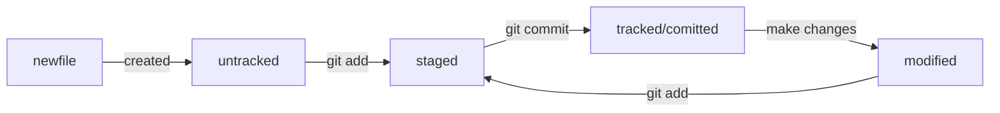

# Шпаргалка

# Markdown

## Выделение текста

Вы можете выделять текст в markdown с помощью символов `_` или `*`. Например:

Пример _курсива_ и **жирного** текста.

## Заголовки

Заголовки можно создавать с помощью символа `#`. Чем больше `#`, тем меньше заголовок. Например:

# Заголовок первого уровня
## Заголовок второго уровня
### Заголовок третьего уровня

## Выделение кода

Чтобы выделить текст как код, поместите его в тройные кавычки `````. 

```
mkdir my_project
cd my_project
git init
```
Это лишь некоторые функции markdown.

# Хеш (hash)

- это информация о коммите в зашифрованном по алгоритму SHA-1 формате

в полном виде - 40 символов (0-9, A-F в любом регистре), в коротком - столько, сколько нужно для уникальности (около 7ми)

# Лог репозитория - git log

выводит список коммитов из 4х строк:
1. хеш коммита
2. автор
3. дата
4. сообщение коммита

## git log --oneline

Коммит в одну строку:
* хеш сокращенно
* 72 первых символа сообщения

# HEAD

## Последний коммит (самый новый)

внутри ссылка на служебный файл refs/heads/master

по ссылке находится хеш коммита

_при необходимости сослаться на последний коммит можно писать HEAD вместо хеш_

# Статусы файлов в GIT



# Изменения последнего коммита

## Флаг --amend

```
%% дополнить коммит новыми файлами
git commit --amend --no-edit

%% --no-edit - сообщение к коммиту остается неизменным

%% дополнить коммит новыми файлами и обновить сообщение
git commit --amend -m "Обновлённое сообщение коммита"
```

# Откатиться назад - отмена изменений

## Unstage изменений 

если нужно убрать файл, добавленный на коммит с помощью *git add*

```
git restore --staged <file>
```

### Пример:

```
$ touch example.txt # создали ненужный файл
$ git add example.txt # добавили его в staged

$ git status # проверили статус
Changes to be committed:
  (use "git restore --staged <file>..." to unstage)
        new file:   example.txt

$ git restore --staged example.txt
$ git status # проверили статус

Untracked files:
  (use "git add <file>..." to include in what will be committed)
        example.txt

no changes added to commit (use "git add" and/or "git commit -a")
# файл example.txt из staged вернулся обратно в untracked
```

команда *git restore* без указания файла сбросит всю текущую папку

## Откатить коммит - вернуть состояние реппозитория до коммита

```
git reset --hard <commit hash>
```
### Пример:

```
$ git log --oneline # хеш можно найти в истории
7b972f5 (HEAD -> master) style: добавить комментарии, расставить отступы
b576d89 feat: добавить массив Expenses и цикл для добавления трат # вот сюда и вернёмся
4b58962 refactor: разделить analyzeExpenses() на countSum() и saveExpenses()

$ git reset --hard b576d89
# теперь мы на этом коммите
HEAD is now at b576d89 feat: добавить массив Expenses и цикл для добавления трат
```

## Откатить изменения файла

Если файл был изменен но еще не отправлен в статус *staged*

```
git restore <file>
```

### Пример:

```
# случайно изменили файл example.txt
$ git status
On branch main
Changes not staged for commit:
  (use "git add <file>..." to update what will be committed)
  (use "git restore <file>..." to discard changes in working directory)
          modified:   example.txt

$ git restore example.txt
$ git status
On branch main
nothing to commit, working tree clean
```

# Просмотреть изменения в файлах

### для файлов в статусе *modified*

```
git diff
```

### для файлов в статусе *staged*

```
git diff --staged
```


