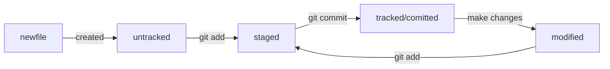

# Шпаргалка

# Markdown

## Выделение текста

Вы можете выделять текст в markdown с помощью символов `_` или `*`. Например:

Пример _курсива_ и **жирного** текста.

## Заголовки

Заголовки можно создавать с помощью символа `#`. Чем больше `#`, тем меньше заголовок. Например:

# Заголовок первого уровня
## Заголовок второго уровня
### Заголовок третьего уровня

## Выделение кода

Чтобы выделить текст как код, поместите его в тройные кавычки `````. 

```
mkdir my_project
cd my_project
git init
```
Это лишь некоторые функции markdown.

# Хеш (hash)

- это информация о коммите в зашифрованном по алгоритму SHA-1 формате

в полном виде - 40 символов (0-9, A-F в любом регистре), в коротком - столько, сколько нужно для уникальности (около 7ми)

# Лог репозитория - git log

выводит список коммитов из 4х строк:
1. хеш коммита
2. автор
3. дата
4. сообщение коммита

## git log --oneline

Коммит в одну строку:
* хеш сокращенно
* 72 первых символа сообщения

# HEAD

## Последний коммит (самый новый)

внутри ссылка на служебный файл refs/heads/master

по ссылке находится хеш коммита

_при необходимости сослаться на последний коммит можно писать HEAD вместо хеш_

# Статусы файлов в GIT



# Изменения последнего коммита

## Флаг --amend

```
%% дополнить коммит новыми файлами
git commit --amend --no-edit

%% --no-edit - сообщение к коммиту остается неизменным

%% дополнить коммит новыми файлами и обновить сообщение
git commit --amend -m "Обновлённое сообщение коммита"
```

# Откатиться назад - отмена изменений

## Unstage изменений 

если нужно убрать файл, добавленный на коммит с помощью *git add*

```
git restore --staged <file>
```

### Пример:

```
$ touch example.txt # создали ненужный файл
$ git add example.txt # добавили его в staged

$ git status # проверили статус
Changes to be committed:
  (use "git restore --staged <file>..." to unstage)
        new file:   example.txt

$ git restore --staged example.txt
$ git status # проверили статус

Untracked files:
  (use "git add <file>..." to include in what will be committed)
        example.txt

no changes added to commit (use "git add" and/or "git commit -a")
# файл example.txt из staged вернулся обратно в untracked
```

команда *git restore* без указания файла сбросит всю текущую папку

## Откатить коммит - вернуть состояние реппозитория до коммита

```
git reset --hard <commit hash>
```
### Пример:

```
$ git log --oneline # хеш можно найти в истории
7b972f5 (HEAD -> master) style: добавить комментарии, расставить отступы
b576d89 feat: добавить массив Expenses и цикл для добавления трат # вот сюда и вернёмся
4b58962 refactor: разделить analyzeExpenses() на countSum() и saveExpenses()

$ git reset --hard b576d89
# теперь мы на этом коммите
HEAD is now at b576d89 feat: добавить массив Expenses и цикл для добавления трат
```

## Откатить изменения файла

Если файл был изменен но еще не отправлен в статус *staged*

```
git restore <file>
```

### Пример:

```
# случайно изменили файл example.txt
$ git status
On branch main
Changes not staged for commit:
  (use "git add <file>..." to update what will be committed)
  (use "git restore <file>..." to discard changes in working directory)
          modified:   example.txt

$ git restore example.txt
$ git status
On branch main
nothing to commit, working tree clean
```

# Просмотреть изменения в файлах

### для файлов в статусе *modified*

```
git diff
```

### для файлов в статусе *staged*

```
git diff --staged
```

# Исключение файлов из отслеживания GIT

Для этого создается текстовый файл *.gitignore* в корне репозитория

### Пример:

```
# вот так можно писать комментарии;
# они ничего не значат для .gitignore,
# но они могут быть полезны, чтобы понять, зачем было добавлено то или иное правило

# игнорировать все файлы, которые заканчиваются на .jpeg
*.jpeg

# игнорировать все файлы "tmp" во всех подпапках папки docs
docs/*/tmp

# странное, но возможное правило
# "игнорировать все файлы"
*

# ? - любой символ
file?.txt

# игнорировать файлы file0.txt, file1.txt и file2.txt
# при этом не игнорировать file3.txt, file4.txt, ...
file[0-2].txt

# игнорировать todo.txt в корне репозитория
/todo.txt

# для сравнения: spam.txt будет игнорироваться во всех папках
spam.txt

# игнорировать папку build
build/

# игнорировать файлы "docs/current/tmp", "docs/old/tmp",
# а также "docs/old/saved/a/b/c/d/tmp"
# и даже "docs/tmp", потому что ноль вложенных папок тоже подходит
docs/**/tmp

# игнорировать только "docs/current/tmp" и "docs/old/tmp"
# файл "docs/old/saved/a/b/c/d/tmp" не попадает в правило
docs/*/tmp

# игнорировать все JPEG-файлы
*.jpeg
# но только не мем с Doge
!doge.jpeg
```

# Клонирование репозитория

- это создание локальной копии

### Необходимо:

- настроить SSH ключи
- копировать SSH ссылку на странице репозитория в разделе *code*
- перейти в папку, где будет размещаться клон

```
$ git clone git@github.com:yandex-praktikum/git-clone-practice.git
```
# Ветки

```
# посмотреть ветки локального репозитория и где находишься (*)
git branch

# посмотреть все ветки
git branch -a

# создание новой ветки
git branch <название_ветки>

# создание новой ветки и переход в нее
git checkout -b <название_ветки>

# переключение веток
Git checkout <название ветки>
```
## Сравнение веток

```
git diff <название_ветки1> <название_ветки2>
```

Пример:
```
# разница между предыдушим и текущим коммитом
$ git diff HEAD~ HEAD

# с использованием суффикса навигации тоже самое
$ git diff feature/diff~1 feature/diff

# с использованием хешей
$ git diff 2ea56ab~ 2ea56ab
```
# Слияние и удаление веток

```
# перейти в ветку, куда мы хотим присоединить изменения (обычно это master(main))

# проводим слияние веток
$ git merge <название_ветки>
```

обычно после слияния ветку донора удаляют

```
git branch -D <название_ветки>
# -D полное удаление (--delite --force)

# нельзя находиться в ветке, которую нужно удалить

# "мягкое" удаление -d (--delite)
git branch -d <название_ветки>
```
# Загрузка новой ветки из локального репозитория

### Пример:

```
# отправить новую ветку в github
$ git push -u origin feature/merge-request

# в консоль будет выведено такое сообщение:
$ git push -u origin feature/merge-request
Total 0 (delta 0), reused 0 (delta 0), pack-reused 0
remote: 
remote: Create a pull request for 'feature/merge-request' on GitHub by visiting:
remote:      https://github.com/%ВАШ_АККАУНТ%/git-branches/pull/new/feature/merge-request
remote: 
To github.com:%ВАШ_АККАУНТ%/git-branches.git
 * [new branch]      feature/merge-request -> feature/merge-request
branch 'feature/merge-request' set up to track 'origin/feature/merge-request'.
```


